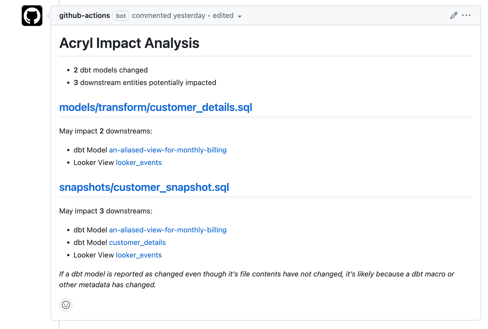

# Acryl dbt action

This GitHub action will comment on your PRs with a summary of the impact of changes within a dbt project.

<p align="center" width="70%">
  
</p>

## Usage

Requirements:
- You must have ingested dbt metadata into Acryl DataHub using acryl-datahub v0.10.1.1 or newer.
- This action was tested with dbt core v1.4.x. It may work with older versions too.

```yml
# Put this in .github/workflows/acryl-dbt-impact.yml.
name: Acryl Impact Analysis

on:
  pull_request:
    types: [opened, synchronize, reopened]

permissions:
  contents: read
  pull-requests: write

jobs:
  impact-analysis:

    runs-on: ubuntu-latest

    steps:
    - uses: actions/checkout@v3
      with:
        # We need the full git history to get a proper list of changed files.
        fetch-depth: 0

    - name: Set up Python
      uses: actions/setup-python@v3
      with:
        python-version: "3.10"

    # TODO(developer): Update this portion to point at your pip requirements file.
    # We assume that this step will install dbt and the dbt adapter you're using.
    # For example, if might install `dbt-snowflake>=1.5.0`.
    - name: Install dependencies
      run: |
        python -m pip install --upgrade pip wheel
        pip install -r requirements.txt

    - name: Run impact analysis
      uses: acryldata/dbt-impact-action@v1
      with:
        # TODO(developer): Update this with your dbt project config.
        # The name of your dbt adapter. One of [bigquery, postgres, redshift, snowflake].
        # Let us know if you need support for another adapter.
        dbt_adapter: postgres

        # If your dbt project is not in the root of your repo,
        # specify the path to it here.
        # dbt_project_folder: .

        # TODO(developer): Update this with your Acryl DataHub config.
        # Credentials to connect to Acryl.
        datahub_gms_host: https://<customer>.acryl.io/gms
        datahub_gms_token: ${{ secrets.ACRYL_GMS_TOKEN }}
        datahub_frontend_url: https://<customer>.acryl.io
```
